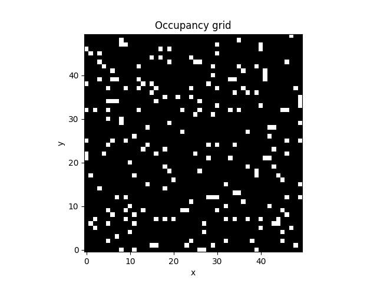
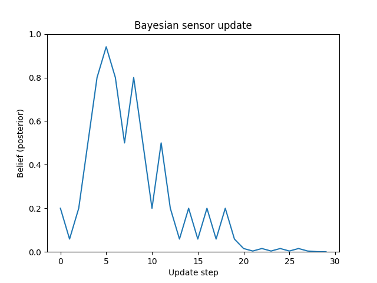
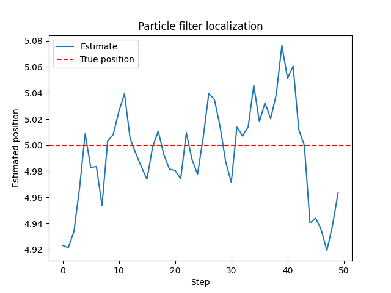

[English](README.md) | Español

# Laboratorio de Percepción Robótica

Experimentos mínimos que ilustran la percepción probabilística y la representación del entorno en sistemas robóticos.

Este repositorio explora técnicas probabilísticas sencillas utilizadas en la percepción robótica, incluyendo modelos de sensores, mapeo de cuadrículas de ocupación y localización probabilística.

Los ejemplos demuestran cómo los robots pueden estimar las propiedades del entorno utilizando datos inciertos de sensores.

## Contenido

El directorio `src/` contiene tres experimentos mínimos:

* `occupancy_grid_mapping.py`

    Demostración de una cuadrícula de ocupación sencilla utilizada para representar la probabilidad de obstáculos en un entorno 2D.

* `bayes_sensor_model.py`

    Implementa un modelo bayesiano básico de actualización de sensores para estimar la probabilidad de presencia de obstáculos.

* `particle_filter_localization.py`

    Simula un filtro de partículas utilizado para la localización probabilística de robots.

## Propósito

Estos experimentos ilustran conceptos de ingeniería relevantes para:

* Percepción robótica
* Robótica probabilística
* Mapeo del entorno
* Localización bajo incertidumbre

## Motivación

Los robots que operan en entornos reales deben percibir e interpretar datos de sensores incompletos y con ruido.

Las técnicas de percepción probabilística permiten a los robots estimar la estructura de su entorno y su posición dentro de él a pesar de la incertidumbre de los sensores.

Estos métodos se utilizan ampliamente en robots autónomos, robótica móvil y vehículos autónomos.

## Método

El repositorio implementa algoritmos simplificados de percepción probabilística.

Los experimentos incluyen:

* Modelos de sensores bayesianos para la estimación del entorno
* Mapeo de cuadrículas de ocupación para la representación de obstáculos
* Filtrado de partículas para la localización probabilística

Estas implementaciones son intencionalmente minimalistas y se centran en ilustrar el comportamiento conceptual de los algoritmos de percepción en lugar de sistemas SLAM completos.

## Ejecución de los ejemplos

Clonar el repositorio y ejecutar cualquiera de los scripts:

```bash
git clone https://github.com/Jorge-de-la-Flor/robot-perception-lab
cd robot-perception-lab
python src/occupancy_grid_mapping.py
```

Cada script simula el comportamiento de la percepción y visualiza las distribuciones de probabilidad resultantes.

## Ejemplo de salida





## Árbol del proyecto

```bash
robot-perception-lab
├─ .python-version
├─ LICENCIA
├─ README.es.md
├─ README.md
├─ activos
│ ├─ occupancy_grid.png
│ ├─ bayes_sensor_model.png
│ └─ particle_filter_localization.png
├─ pyproject.toml
├─ src
│ ├─ bayes_sensor_model.py
│ ├─ occupancy_grid_mapping.py
│ └─ particle_filter_localization.py
└─ uv.lock
```

## Requisitos

Los ejemplos usan:

* Python 3.12+
* NumPy
* Matplotlib

## Instalación

Instale las dependencias necesarias:

* using `pip`

```bash
pip install numpy matplotlib
```

* using `uv`

```bash
uv add numpy matplotlib
```

## Referencias

* Thrun, S., Burgard, W. y Fox, D. (2005).
    *Robótica Probabilística.*

* Elfes, A. (1989).
    *Cuadrículas de Ocupación: Una Representación Espacial Estocástica para la Percepción Activa de Robots.*
